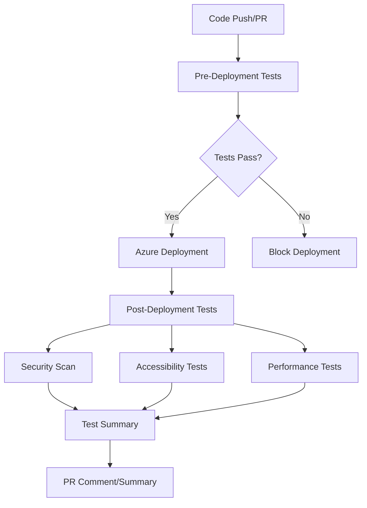

# ATT&CK Navigator Testing Suite

This document provides a comprehensive overview of the testing approach implemented for the ATT&CK Navigator application, including local development testing, CI/CD pipeline integration, and deployment verification.

## ?? Testing Strategy Overview

Our testing strategy follows a multi-layered approach to ensure the ATT&CK Navigator application maintains high quality, performance, and security standards:

### Testing Layers

1. **Unit Testing** - Component and service-level testing with Jest/Jasmine
2. **Integration Testing** - API and service integration testing
3. **End-to-End Testing** - User journey testing with Cypress
4. **Cross-Browser Testing** - Multi-browser compatibility with Selenium WebDriver
5. **Performance Testing** - Load time and responsiveness testing with Playwright
6. **Visual Regression Testing** - UI consistency verification
7. **Security Testing** - Vulnerability scanning and dependency auditing
8. **Accessibility Testing** - WCAG compliance verification

## ??? Testing Tools & Technologies

| Tool | Purpose | Configuration |
|------|---------|---------------|
| **Karma + Jasmine** | Unit testing Angular components | `karma.conf.js` |
| **Jest** | Unit testing utilities and Node.js code | `jest.config.json` |
| **Cypress** | End-to-end testing | `cypress.config.ts` |
| **Selenium WebDriver** | Cross-browser testing | `tests/selenium/` |
| **Playwright** | Performance testing | `playwright.config.ts` |
| **Trivy** | Security vulnerability scanning | GitHub Actions |
| **axe-core** | Accessibility testing | GitHub Actions |
| **Docker** | Containerized testing | `Dockerfile`, `docker-compose.test.yml` |

## ?? Getting Started

### Prerequisites

- Node.js 16+ 
- npm 7+
- Chrome/Chromium (for headless testing)
- Docker (optional, for containerized testing)

### Installation

```bash
# Navigate to the nav-app directory
cd nav-app

# Install dependencies
npm ci --legacy-peer-deps

# Verify installation
npm run test:ci
```

## ?? Running Tests

### Local Development

```bash
# Run all tests
npm run test:all

# Individual test suites
npm run test:ci           # Unit tests with coverage
npm run e2e:ci           # Cypress E2E tests
npm run test:selenium    # Selenium cross-browser tests
npm run test:performance # Playwright performance tests

# Watch mode for development
npm run test:watch       # Unit tests in watch mode
npm run e2e              # Cypress interactive mode
```

### Using Our Test Scripts

```bash
# Comprehensive test validation
./scripts/run-comprehensive-tests.sh

# Test environment verification
./scripts/verify-tests.sh
```

### Docker Testing

```bash
# Run Docker unit tests
npm run test:docker:unit

# Run Docker E2E tests  
npm run test:docker:e2e

# Run Docker cross-browser tests
npm run test:docker:selenium

# Run all Docker tests
npm run test:docker:all

# Alternative: Direct Docker Compose commands
docker-compose -f docker-compose.test.yml up app-test
docker-compose -f docker-compose.test.yml --profile e2e up
docker-compose -f docker-compose.test.yml --profile selenium up
```

## ?? Test Coverage

### Coverage Thresholds

| Metric | Minimum Threshold |
|--------|-------------------|
| Statements | 80% |
| Branches | 75% |
| Functions | 80% |
| Lines | 80% |

### Viewing Coverage Reports

```bash
# Generate coverage report
npm run test:coverage

# View HTML report
open coverage/nav-app/lcov-report/index.html
```

## ?? CI/CD Integration

### GitHub Actions Workflows

#### Enhanced Azure Integration (`azure-static-web-apps-happy-field-007f63b03.yml`)

Our primary workflow that integrates with Azure Static Web Apps:

1. **Pre-Deployment Testing**
   - Unit tests with coverage
   - Linting
   - Build verification
   - Coverage threshold validation

2. **Azure Deployment**
   - Automated deployment to Azure Static Web Apps
   - Environment variable management
   - Build artifact verification

3. **Post-Deployment Testing**
   - E2E tests against live deployment
   - Cross-browser compatibility testing
   - Performance benchmarking
   - Security scanning
   - Accessibility verification

4. **Test Reporting**
   - Comprehensive test summaries
   - PR comments with test results
   - Artifact collection and storage

#### Comprehensive Test Suite (`comprehensive-test-suite.yml`)

A standalone comprehensive testing workflow for development branches:

- Parallel test execution
- Matrix testing across browsers
- Docker container testing
- Security and accessibility scanning

### Test Execution Flow



## ?? Test Structure

### Unit Tests

```
nav-app/src/
??? app/
?   ??? component-name/
?   ?   ??? component-name.component.ts
?   ?   ??? component-name.component.spec.ts
?   ??? services/
?   ?   ??? service-name.service.ts
?   ?   ??? service-name.service.spec.ts
?   ??? ...
??? test-utils/
    ??? docker-helpers.ts
```

### E2E Tests

```
nav-app/cypress/
??? e2e/
?   ??? navigator-functionality.cy.ts
?   ??? visual-regression.cy.ts
??? support/
?   ??? commands.ts
??? cypress.config.ts
```

### Cross-Browser Tests

```
nav-app/tests/
??? selenium/
?   ??? cross-browser.spec.ts
??? performance/
?   ??? performance.spec.ts
??? setup.ts
```

## ?? Custom Test Commands

### Cypress Custom Commands

We've created custom Cypress commands specific to ATT&CK Navigator:

```typescript
// Usage examples
cy.waitForNavigatorLoad();
cy.selectTechnique('T1059');
cy.addTechniqueComment('Test comment');
cy.setTechniqueScore(85);
cy.switchMatrixLayout('flat');
cy.createNewLayer();
cy.searchTechniques('powershell');
```

### Test Utilities

Helper functions for containerized and CI environments:

```typescript
// Docker-aware testing
DockerTestHelpers.isRunningInDocker();
DockerTestHelpers.getBaseUrl();
DockerTestHelpers.getTestTimeout();
```

## ?? Debugging Tests

### Local Debugging

```bash
# Debug unit tests
npm run test:watch

# Debug E2E tests (interactive)
npm run e2e

# Debug with specific browser
npx cypress run --browser firefox --headed

# Debug Selenium tests
DEBUG=selenium npm run test:selenium
```

### CI Debugging

Test artifacts are automatically uploaded in GitHub Actions:

- Cypress screenshots and videos
- Performance reports
- Coverage reports
- Security scan results
- Accessibility reports

## ?? Test Failures & Troubleshooting

### Common Issues

1. **Chrome/Chromium not found**
   ```bash
   # Install Chrome for testing
   npm install -g puppeteer
   # or set CHROME_BIN environment variable
   export CHROME_BIN=/usr/bin/chromium-browser
   ```

2. **Port 4200 already in use**
   ```bash
   # Kill existing processes
   npx kill-port 4200
   # or use different port
   ng serve --port 4201
   ```

3. **Memory issues in CI**
   - Increase Node.js memory: `NODE_OPTIONS=--max-old-space-size=4096`
   - Use headless browsers: `--headless` flag

4. **Docker permission issues**
   ```bash
   sudo chmod +x scripts/*.sh
   docker run --privileged
   ```

### Test Failure Resolution

1. **Check test logs** in GitHub Actions artifacts
2. **Review screenshots/videos** for E2E failures
3. **Analyze coverage reports** for missing test coverage
4. **Check security scan results** for vulnerabilities
5. **Validate accessibility reports** for WCAG violations

## ?? Performance Monitoring

### Metrics Tracked

- **Load Time**: Initial page load
- **Time to Interactive**: User interaction readiness
- **Memory Usage**: Runtime memory consumption
- **Bundle Size**: Application size optimization
- **Core Web Vitals**: LCP, FID, CLS metrics

### Performance Thresholds

| Metric | Target | Maximum |
|--------|--------|---------|
| Load Time | < 3s | < 5s |
| Bundle Size | < 10MB | < 20MB |
| Memory Usage | < 100MB | < 200MB |
| LCP | < 2.5s | < 4s |

## ?? Security Testing

### Automated Scans

- **Dependency Audit**: `npm audit`
- **Vulnerability Scanning**: Trivy
- **SARIF Report**: GitHub Security tab integration
- **License Compliance**: Dependency license checking

### Security Checklist

- [ ] No high/critical vulnerabilities
- [ ] Dependencies up to date
- [ ] Secure headers present
- [ ] No hardcoded secrets
- [ ] CSP policies configured

## ? Accessibility Testing

### WCAG Compliance

- **Level AA compliance** target
- **Automated testing** with axe-core
- **Manual testing** guidelines
- **Color contrast** verification
- **Keyboard navigation** support

### Accessibility Checklist

- [ ] Alt text for images
- [ ] Proper heading structure
- [ ] Keyboard navigation
- [ ] Screen reader compatibility
- [ ] Color contrast ratios
- [ ] Focus management

## ?? Additional Resources

### Documentation

- [Cypress Documentation](https://docs.cypress.io/)
- [Selenium WebDriver Docs](https://selenium-webdriver.readthedocs.io/)
- [Playwright Documentation](https://playwright.dev/)
- [Angular Testing Guide](https://angular.io/guide/testing)

### Best Practices

- Write tests before fixing bugs
- Use data-cy attributes for stable selectors
- Mock external dependencies
- Test edge cases and error conditions
- Keep tests focused and atomic
- Use page object patterns for E2E tests

### Contributing

When adding new features:

1. Write unit tests for new components/services
2. Add E2E tests for new user workflows
3. Update visual regression baselines
4. Verify accessibility compliance
5. Check performance impact
6. Update test documentation

## ?? Support

For testing-related issues:

1. Check existing test documentation
2. Review GitHub Actions logs
3. Create issues with test failure details
4. Include environment information
5. Provide reproduction steps

---

**Note**: This testing suite is designed to ensure the ATT&CK Navigator maintains high quality standards while supporting rapid development and deployment cycles. Regular updates to testing strategies and tools help us stay current with best practices and emerging technologies.